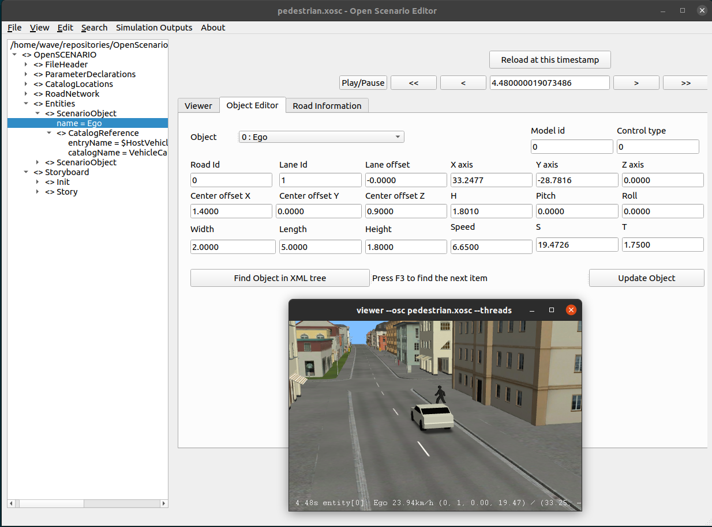

### Open Scenario Editor
_Open Scenario Editor_ is a simple ASAM OpenSCENARIO (*.xosc) editor based on [Environment Simulator Minimalistic (esmini)](https://github.com/esmini/esmini).

ASAM OpenSCENARIO defines a file format for the description of the dynamic content of driving and traffic simulators. The primary use-case of OpenSCENARIO is to describe complex, synchronized maneuvers that involve multiple entities like vehicles, pedestrians and other traffic participants. The description of a maneuver may be based on driver actions (e.g. performing a lane change) or on trajectories (e.g. derived from a recorded driving maneuver). Other content, such as the description of the ego vehicle, driver appearance, pedestrians, traffic and environment conditions, is included in the standard as well. You can also read more about [OpenSCENARIO format on the ASAM website](https://www.asam.net/standards/detail/openscenario/).

#### Running on Windows

- First install Python **3** and use pip tool to install PyQt5 (`pip install pyqt5`) 

- [Download the prebuilt binary release package](https://github.com/ebadi/OpenScenarioEditor/releases) and unpack it.
- Run the OpenScenarioEditor.py script:  `python  OpenScenarioEditor.py`

#### Building and running on Linux
First clone the repository:
```
git clone https://github.com/ebadi/OpenScenarioEditor ~/OpenScenarioEditor
```

To build and run on Ubuntu (tested on 20.04), simply run the following command that automatically downloads [Environment Simulator Minimalistic (esmini)
](https://github.com/esmini/esmini]), [PyEsmini](https://github.com/ebadi/pyesmini) and required resources/dependencies.
```
cd ~/OpenScenarioEditor
./run.sh
```

Take a look at our demo video by clicking on the image below:

[](https://youtu.be/XvoPWt66IqI)


#### Credits

This work is done by [Infotiv AB](https://www.infotiv.se) under [VALU3S](https://valu3s.eu/) project. This project has received funding from the [ECSEL](https://www.ecsel.eu) Joint Undertaking (JU) under grant agreement No 876852. The JU receives support from the European Union’s Horizon 2020 research and innovation programme and Austria, Czech Republic, Germany, Ireland, Italy, Portugal, Spain, Sweden, Turkey.

[Open Scenario Editor](https://github.com/ebadi/OpenScenarioEditor) project is started and currently maintained by Hamid Ebadi.
